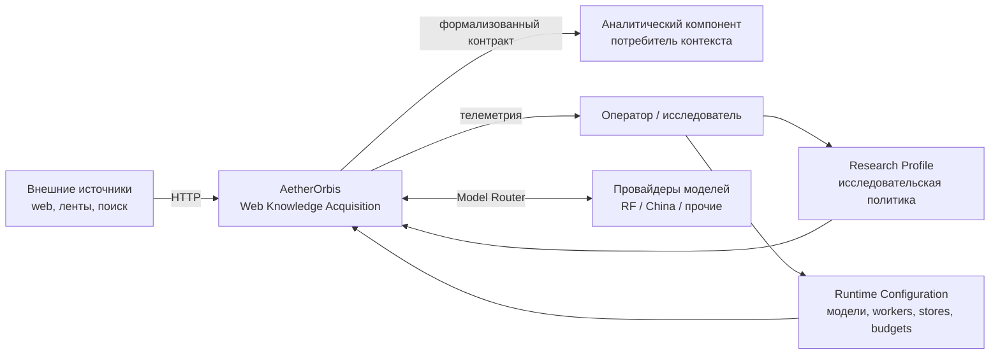
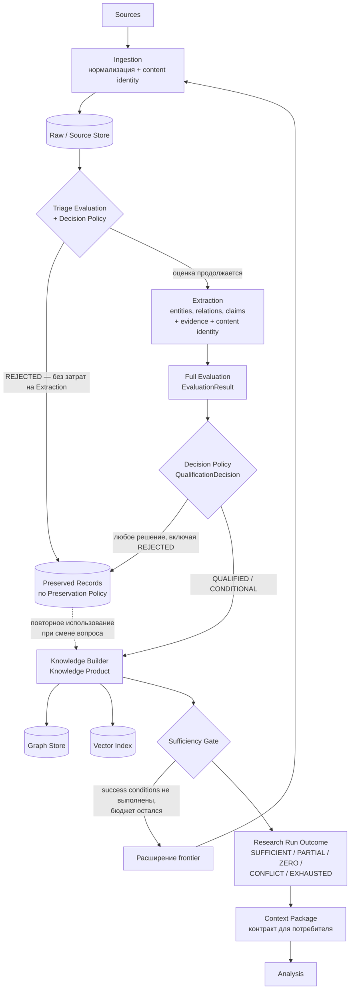
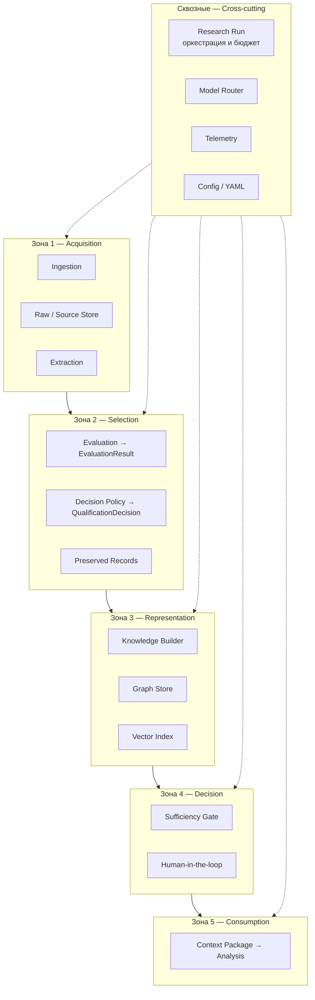
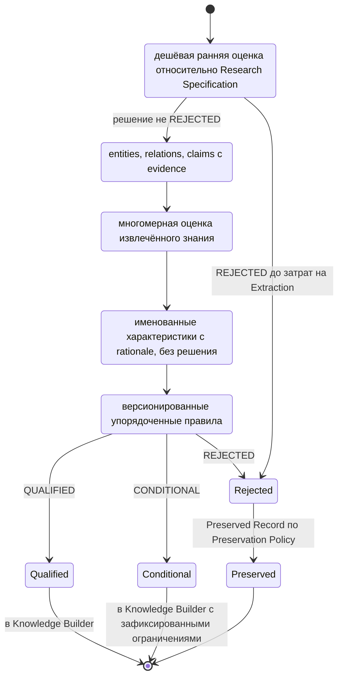
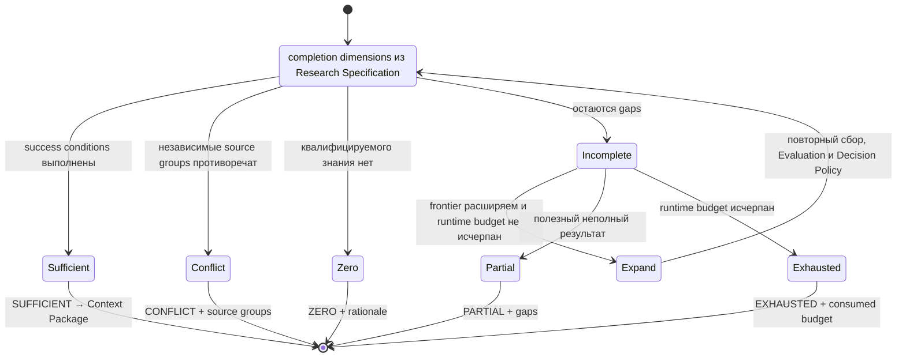
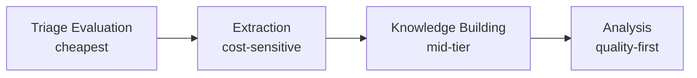
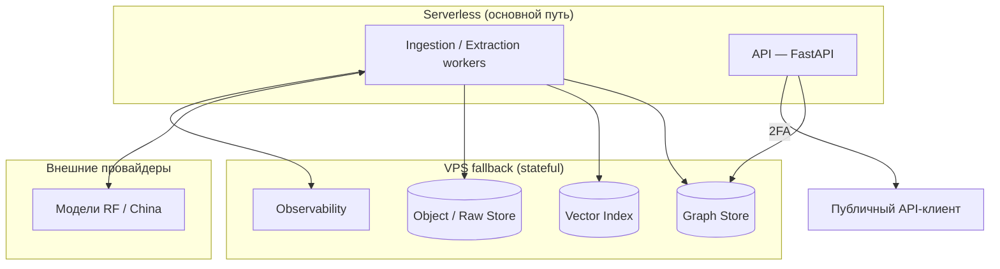
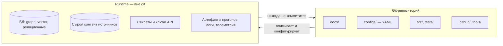

# AetherOrbis — Архитектура

Документ описывает **как** система устроена: потоки данных, зоны ответственности и точки принятия
решений. Что именно система делает — см. [`docs/concept.md`](concept.md). Термины употребляются в
значении [`docs/standards/glossary.md`](standards/glossary.md).

Разделы 2–7 отражают реализацию Фазы 1 (`src/aether_orbis/`), разделы 8–9 — целевое развёртывание
по [ADR-003](adr/2026-08-adr-003-infrastructure.md), которое ещё не выполнено.

## 1. Контекстная диаграмма

## 2. Основной поток данных

Квалификация разделена на два шага: дешёвый **Triage Evaluation** решает, стоит ли платить за
Extraction, а **Full Evaluation** оценивает уже извлечённое знание. Решение в обоих случаях
принимает не Evaluation, а отдельная версионированная **Decision Policy**: `EvaluationResult`
содержит только именованные характеристики с rationale ([ADR-005](adr/2026-09-adr-005-evaluation-result.md)).
Отклонённый материал не исчезает: **Preserved Record** с content identity и provenance создаётся для
каждого оценённого материала независимо от решения, а состав записи задаёт объявленная Preservation
Policy ([ADR-004](adr/2026-09-adr-004-preservation-policy.md)).

Граф и вектор строятся **параллельно и независимо** из одного и того же квалифицированного потока:
вектор не является следствием построения графа, ни одно из двух представлений не является
предусловием другого, и прогон с одним отключённым представлением — или без обоих — даёт тот же
Research Run document. Sufficiency Gate тоже читает квалифицированный поток напрямую, а не
результаты индексации.

## 3. Зоны ответственности

| Зона | Владеет | Не имеет права |
| --- | --- | --- |
| Acquisition | сбором, хранением сырого материала, извлечением утверждений с evidence | строить знание, оценивать релевантность для задачи |
| Selection | измерением характеристик (`EvaluationResult`), решением `QUALIFIED` / `CONDITIONAL` / `REJECTED` и сохранением отклонённого материала | изменять содержимое claims, смешивать оценку с решением |
| Representation | решением, что становится узлом и ребром, и entity resolution | пере-извлекать данные из источника |
| Decision | итогом `SUFFICIENT` / `PARTIAL` / `ZERO` / `CONFLICT` / `EXHAUSTED` | делать предметные выводы |
| Consumption | рассуждением поверх Context Package | обращаться к источникам напрямую в обход контракта |
| Cross-cutting | версиями прогона, бюджетом, выбором модели, наблюдаемостью, конфигурацией | задавать исследовательские критерии и принимать решения gates |

Жёсткое правило: **Parser ≠ Knowledge Builder ≠ Analysis**. Флаг вида `--build-graph` внутри
парсера отклонён как нарушение границы зон.

## 4. Точки вариативности пайплайна

Единый acquisition pipeline конфигурируется в четырёх контрактных точках:

1. **Research Specification** — цель, target и стратегия frontier.
2. **EvaluationResult + Decision Policy** — измеряемые характеристики и правила вывода решения.
3. **Preservation Policy** — состав сохраняемого материала, производного знания и истории.
4. **Termination / Sufficiency Policy** — условия завершения и статус исхода прогона.

Это **контрактные точки вариативности**, а не отдельные runtime-компоненты. Компонентные границы и
последовательность основного потока данных остаются общими для всех моделей Acquisition: в Фазе 1
`AM-1 Domain Monitoring` и `AM-2 Entity / Relationship Extraction` исполняются одной кодовой базой
и различаются только Research Specification.
Research Profile содержит исследовательскую политику, а отдельная Runtime Configuration — модели,
workers, stores, budgets и retries; смешение этих классов запрещено схемами.

## 5. Логика квалификации материала

Обе стадии оценки и оба решения — с идентичностью, версией политики и rationale — попадают в
Research Run document, поэтому исход прогона восстановим без доступа к содержимому источников.
Нормативная форма перехода — [`relevance-gate-contract`](standards/relevance-gate-contract.md).

## 6. Логика Sufficiency Gate

Цикл `Incomplete → Expand → Evaluate` ограничен Runtime Configuration: числовые лимиты
(`max_iterations`, `max_cost_rub`) приходят только оттуда, исследовательские критерии — только из
Research Specification. Итог различает неполноту, отсутствие данных, противоречие и исчерпание
ресурсов; каждый статус содержит coverage, gaps, conflicts, recommended expansion и rationale и
передаётся потребителю в составе Context Package.

## 7. Экономика по ролям операций

| Шаг | Профиль | Приёмы снижения стоимости |
| --- | --- | --- |
| Triage evaluation | cheapest | оценка без Extraction, отсев до дорогих шагов |
| Extraction | cost-sensitive | дешёвые модели, batch API (−50 %), prompt caching (−90 %), semantic caching |
| Knowledge building | mid-tier | батчирование, дедупликация сущностей |
| Analysis | quality-first | вход ограничен квалифицированным и достаточным контекстом |

Главный рычаг экономики — квалификация: Triage Evaluation определяет, какая доля собранного вообще
доходит до Extraction, а Decision Policy — какая доля извлечённого доходит до Analysis.

## 8. Развёртывание

Обоснование serverless-first, требований юрисдикции РФ и обязательной 2FA — см.
[ADR-003](adr/2026-08-adr-003-infrastructure.md).

## 9. Граница репозитория и runtime

## 10. Связанные артефакты

- [`docs/concept.md`](concept.md) — компоненты и контракты
- [`docs/standards/glossary.md`](standards/glossary.md) — единственный источник истины для терминов
- [`docs/standards/research-specification-contract.md`](standards/research-specification-contract.md)
- [`docs/standards/preservation-contract.md`](standards/preservation-contract.md)
- [`docs/standards/sufficiency-gate-contract.md`](standards/sufficiency-gate-contract.md)
- [`configs/schemas/`](../configs/schemas/) — исполняемые схемы контрактов
- [`docs/adr/README.md`](adr/README.md) — технические решения
- [`docs/running-locally.md`](running-locally.md) — как исполнить описанный поток локально
- [`docs/roadmap.md`](roadmap.md) — состояние фаз и границы Фазы 1
