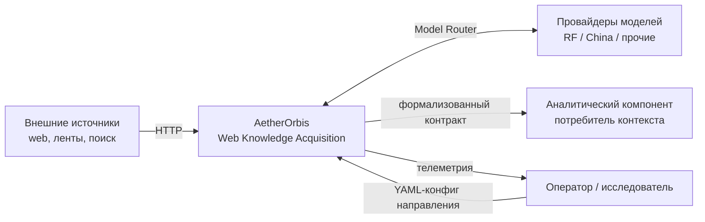
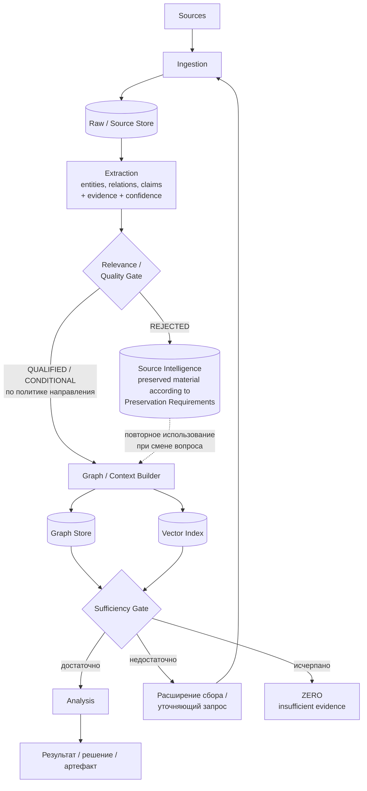
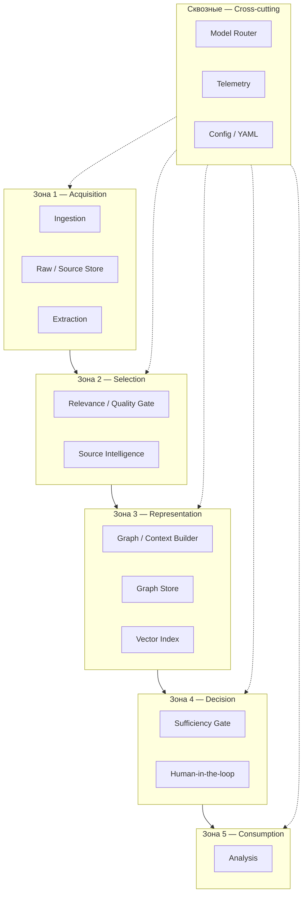
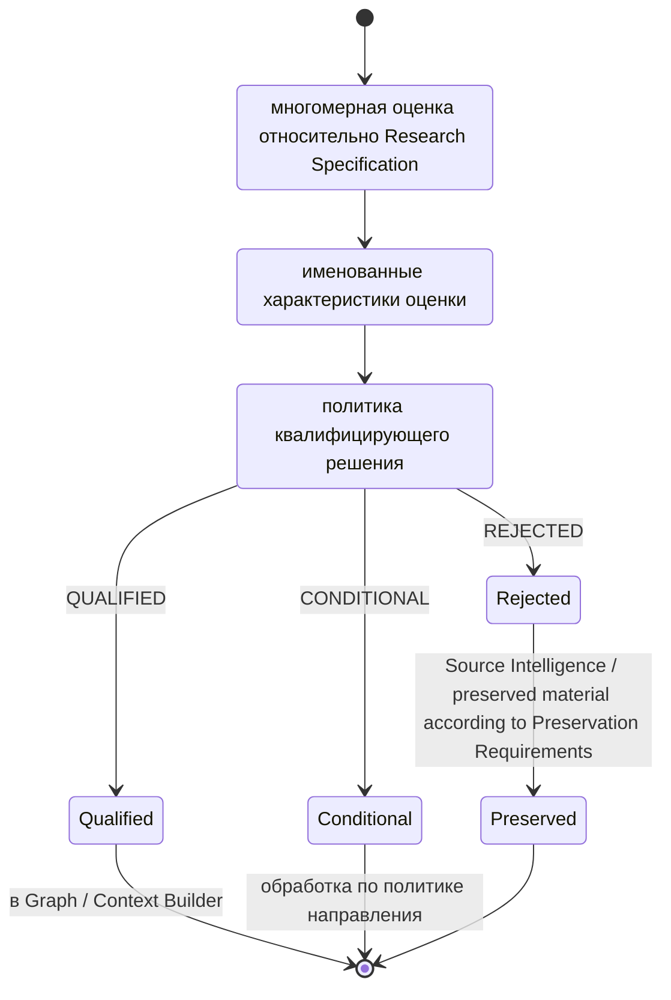
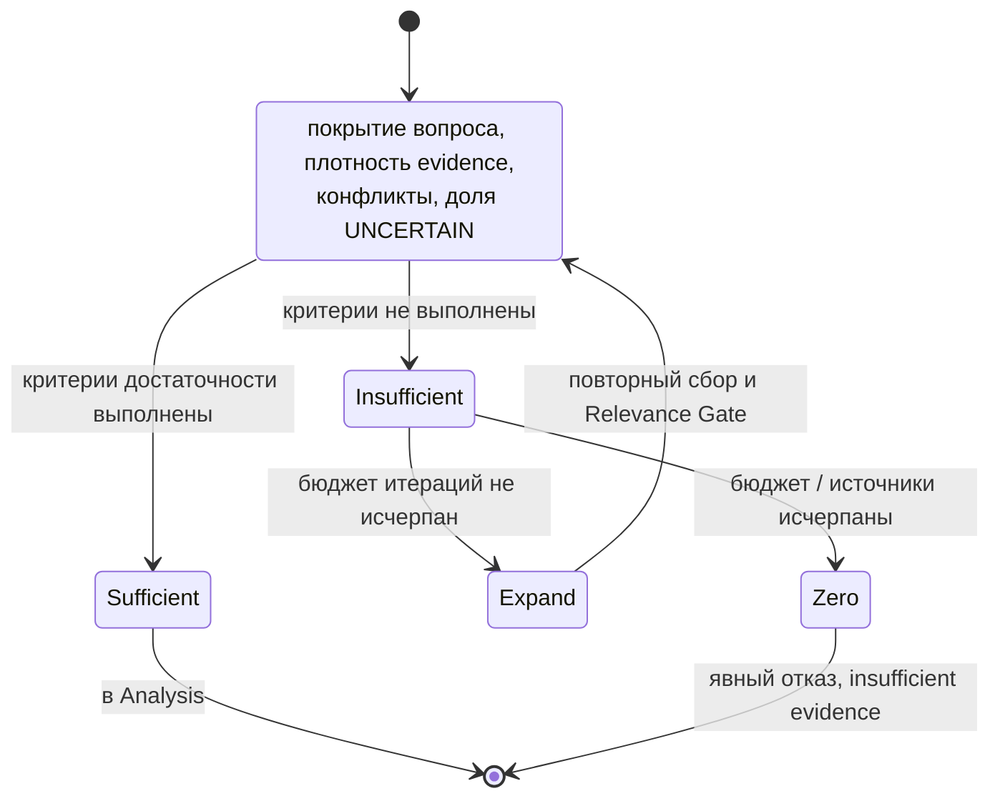
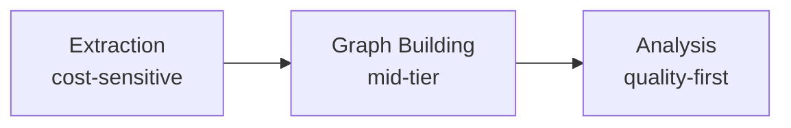
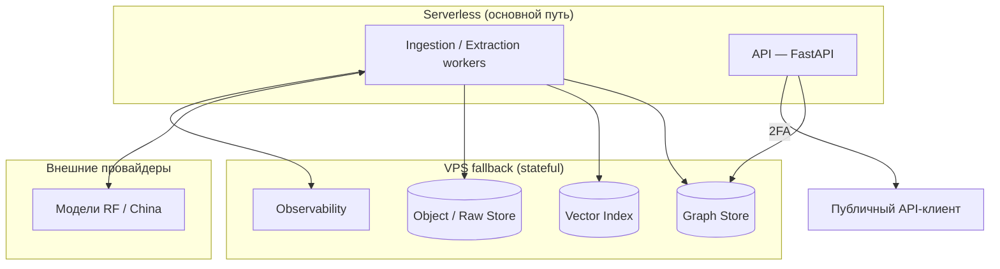
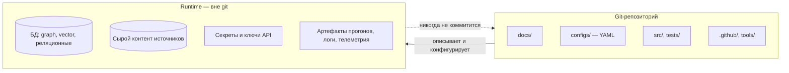

# AetherOrbis — Архитектура

Документ описывает **как** система устроена: потоки данных, зоны ответственности и точки принятия
решений. Что именно система делает — см. [`docs/concept.md`](concept.md).

## 1. Контекстная диаграмма

## 2. Основной поток данных

Граф и вектор строятся **параллельно** из одного и того же прошедшего gate материала; вектор не
является следствием построения графа.

## 3. Зоны ответственности

| Зона | Владеет | Не имеет права |
| --- | --- | --- |
| Acquisition | сбором, хранением сырого материала, извлечением утверждений | строить граф, оценивать релевантность для задачи |
| Selection | решением `QUALIFIED` / `CONDITIONAL` / `REJECTED` и сохранением отклонённого материала | изменять содержимое claims |
| Representation | решением, что становится ребром графа, и entity resolution | пере-извлекать данные из источника |
| Decision | решением «достаточно / недостаточно / ZERO» | делать предметные выводы |
| Consumption | рассуждением поверх контекста | обращаться к источникам напрямую в обход контракта |
| Cross-cutting | выбором модели, наблюдаемостью, конфигурацией | принимать решения gates |

Жёсткое правило: **Parser ≠ Graph Builder ≠ Analysis**. Флаг вида `--build-graph` внутри парсера
отклонён как нарушение границы зон.

## 4. Точки вариативности пайплайна

Единый acquisition pipeline конфигурируется в четырёх контрактных точках:

1. **Research Specification** — цель, target и стратегия frontier.
2. **Evaluation Result + Decision Policy** — измеряемые характеристики и правила вывода решения.
3. **Preservation Requirements** — состав сохраняемого материала и производного знания.
4. **Termination / Sufficiency Policy** — условия завершения и статус исхода прогона.

Это **контрактные точки вариативности**, а не отдельные runtime-компоненты. Компонентные границы и
последовательность основного потока данных остаются общими для всех моделей Acquisition.

## 5. Логика Relevance Gate

## 6. Логика Sufficiency Gate

Цикл `Insufficient → Expand → Evaluate` ограничен бюджетом итераций и бюджетом стоимости; выход по
исчерпанию любого из них даёт `ZERO`, а не «лучшее из имеющегося».

## 7. Экономика по ролям операций

| Шаг | Профиль | Приёмы снижения стоимости |
| --- | --- | --- |
| Extraction | cost-sensitive | дешёвые модели, batch API (−50 %), prompt caching (−90 %), semantic caching |
| Graph building | mid-tier | батчирование, дедупликация сущностей |
| Analysis | quality-first | вход ограничен прошедшим оба gate контекстом |

Relevance Gate — главный рычаг экономики: он определяет, какая доля собранного вообще доходит до
дорогого шага.

## 8. Развёртывание

Обоснование serverless-first, требований юрисдикции РФ и обязательной 2FA — см.
[ADR-003](adr/2026-08-adr-003-infrastructure.md).

## 9. Граница репозитория и runtime

## 10. Связанные артефакты

- [`docs/concept.md`](concept.md) — компоненты и контракты
- [`docs/standards/`](standards/) — контракты границ
- [`docs/adr/README.md`](adr/README.md) — технические решения
