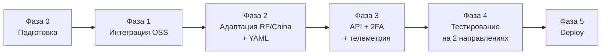

# AetherOrbis — Роадмап

Фазы подготовки, интеграции и вывода MVP. Оценки даны с буфером: исходные оптимистичные оценки
4–7 дней на фазу зафиксированы в SSOT как риск, рабочий ориентир — ~10 дней с буфером.

Каждая задача фаз 1–5 имеет соответствующий GitHub Issue со связями `blocked by` / `blocks`;
реестр — в таблице [«Задачи и зависимости»](#задачи-и-зависимости). Задачи фазы 0 отдельных issue
не имеют: они закрываются подготовительным issue
[#1](https://github.com/G-Ivan-A/aether-orbis/issues/1) и соответствующим PR.

## Обзор фаз

## Фаза 0 — Подготовка

**Цель:** закрыть подготовительный R&D и получить репозиторий, по которому можно начинать работу.

| Задача | Результат |
| --- | --- |
| T0.1 Структура репозитория по архетипу Spoke Хаба | дерево каталогов, root-артефакты, CI |
| T0.2 Документы уровней 1–2 | `docs/vision.md`, `docs/concept.md`, `docs/architecture.md` |
| T0.3 ADR уровня 4 | ADR-001, ADR-002, ADR-003 |
| T0.4 Контракты уровня 4 | четыре контракта в `docs/standards/` |
| T0.5 Роадмап и задачи | `docs/roadmap.md` + GitHub Issues со связями |

**Definition of Done:** структура соответствует архетипу; документы L1–L4 созданы и заполнены;
контракты и ADR соответствуют SSOT v4.3; issues созданы; PR готов к ревью.

**Статус:** завершена; ADR-001…ADR-003 остаются `proposed`, ADR-004…ADR-006 приняты, основа
репозитория создана.

## Фаза 1 — Интеграция open-source

**Цель:** подтвердить исполнимость единого acquisition pipeline на двух моделях — `AM-1 Domain
Monitoring` и `AM-2 Entity / Relationship Extraction` — с конфигурируемыми четырьмя точками
вариативности.

**Ограничения Фазы 1:** `source_group_id` формируется только по `canonical_url` или точному
`content_hash`; `observation_history` принимает только значение `latest_only`; профиль `archival`
применяется только при явном указании в конфигурации.

| Задача | Результат |
| --- | --- |
| P1-A Контракты и исполнимые Research Specifications ([#35](https://github.com/G-Ivan-A/aether-orbis/issues/35)) | схемы и контракты v1.0, валидируемые профили AM-1/AM-2, примеры выразимости AM-1…AM-5 |
| P1-B Acquisition core | ingestion, extraction, evaluation и preservation из Research Specification |
| P1-C Persistence, orchestration и end-to-end доказательство | graph/vector representations, Research Run и сквозные прогоны AM-1/AM-2 |

**P1-A Definition of Done:** контракты согласованы с ADR-004/005/006; положительные и негативные
fixtures, два исполняемых профиля, отдельный runtime-конфиг и пять аналитических примеров проходят
CI. Реализация ingestion, LLM, persistence и end-to-end прогона остаётся в P1-B/P1-C.

**Definition of Done всей Фазы 1:** один прогон от источника до контекста проходит целиком; выдача
Extraction проходит валидацию по [`extraction-contract`](standards/extraction-contract.md); выбор
графовой БД зафиксирован в ADR-001.

**Риски:** слепое доверие OSS-решениям; недооценка качества извлечения. Митигация — T1.1 и
evaluation фазы 2.

## Фаза 2 — Адаптация под модели РФ/Китая и YAML-конфигурации

**Цель:** сделать пайплайн независимым от конкретного провайдера и конфигурируемым по направлениям.

| Задача | Результат |
| --- | --- |
| T2.1 Model Router поверх LiteLLM | вызовы моделей только через Router |
| T2.2 Подключение моделей РФ (YandexGPT, GigaChat) и Китая (Qwen, DeepSeek) | рабочие профили провайдеров |
| T2.3 Evaluation качества извлечения на целевых моделях | отчёт и пороги приемлемости |
| T2.4 YAML-конфигурации направлений | добавление направления без изменения кода |
| T2.5 Кэширование и batch API на cost-sensitive ролях | подтверждённое снижение стоимости |

**Definition of Done:** смена модели для роли выполняется конфигурацией; evaluation показывает
приемлемое качество извлечения на моделях РФ/Китая; второе направление добавляется YAML-конфигом.

## Фаза 3 — API, 2FA и телеметрия

**Цель:** сделать систему наблюдаемой и доступной потребителю.

| Задача | Результат |
| --- | --- |
| T3.1 Реализация Relevance Gate по контракту | решения, Source Intelligence |
| T3.2 Реализация Sufficiency Gate по контракту | `SUFFICIENT` / `PARTIAL` / `ZERO` / `CONFLICT` / `EXHAUSTED` с объяснением |
| T3.3 Телеметрия по контракту | события на каждом переходе, сводка прогона |
| T3.4 Публичный API на FastAPI | эндпоинты запуска прогона и получения контекста |
| T3.5 Обязательная 2FA (TOTP или IAM) | защищённый доступ |
| T3.6 Точки human-in-the-loop (заглушки) | логируемые события `hitl` |

**Definition of Done:** оба gate работают по контрактам; телеметрия пишется по каждому переходу;
публичные эндпоинты недоступны без второго фактора.

## Фаза 4 — Тестирование на двух направлениях

**Цель:** подтвердить масштабируемость на конфигурации, а не на коде.

| Задача | Результат |
| --- | --- |
| T4.1 Направление «Репутационные технологии (GRA)» | прогон и отчёт |
| T4.2 Направление «Анализ практик Хаба (Habr)» | прогон и отчёт |
| T4.3 Тест явного `ZERO` при недостаточном контексте | негативный тест в CI |
| T4.4 Сверка стоимости прогона с бюджетом | отчёт по телеметрии |

**Definition of Done:** оба направления отработали на одной кодовой базе, различаясь только YAML;
`ZERO` воспроизводимо возвращается при искусственно обеднённом сборе; фактическая стоимость известна.

## Фаза 5 — Развёртывание

**Цель:** вывести систему в целевую инфраструктуру по ADR-003.

| Задача | Результат |
| --- | --- |
| T5.1 Serverless-развёртывание вычислительных шагов | рабочие воркеры |
| T5.2 VPS для состояния (graph, vector, raw, observability) | развёрнутые хранилища |
| T5.3 Управление секретами и переменными `AETHER_ORBIS_*` | секреты вне репозитория |
| T5.4 Резервное копирование Raw / Source Store | проверенное восстановление |
| T5.5 Проверка соответствия юрисдикции и границы репозиторий/runtime | чек-лист перед релизом |

**Definition of Done:** прогон запускается в целевой инфраструктуре; runtime-данные отсутствуют в
git; восстановление из резервной копии проверено.

## Задачи и зависимости

| Задача | Issue | Blocked by | Blocks |
| --- | --- | --- | --- |
| T0.1 | закрыта настоящим PR | — | T0.2 |
| T0.2 | закрыта настоящим PR | T0.1 | T0.3, T0.4 |
| T0.3 | закрыта настоящим PR | T0.2 | [P1-A](https://github.com/G-Ivan-A/aether-orbis/issues/35) |
| T0.4 | закрыта настоящим PR | T0.2 | [P1-A](https://github.com/G-Ivan-A/aether-orbis/issues/35), [T3.1](https://github.com/G-Ivan-A/aether-orbis/issues/14), [T3.2](https://github.com/G-Ivan-A/aether-orbis/issues/15), [T3.3](https://github.com/G-Ivan-A/aether-orbis/issues/16) |
| T0.5 | закрыта настоящим PR | T0.2 | [P1-A](https://github.com/G-Ivan-A/aether-orbis/issues/35) |
| P1-A | [#35](https://github.com/G-Ivan-A/aether-orbis/issues/35) | T0.3, T0.4, T0.5 | [P1-B](https://github.com/G-Ivan-A/aether-orbis/issues/36) |
| P1-B | [#36](https://github.com/G-Ivan-A/aether-orbis/issues/36) | [P1-A](https://github.com/G-Ivan-A/aether-orbis/issues/35) | [P1-C](https://github.com/G-Ivan-A/aether-orbis/issues/37) |
| P1-C | [#37](https://github.com/G-Ivan-A/aether-orbis/issues/37) | [P1-B](https://github.com/G-Ivan-A/aether-orbis/issues/36) | [T2.1](https://github.com/G-Ivan-A/aether-orbis/issues/9), [T2.4](https://github.com/G-Ivan-A/aether-orbis/issues/12), [T5.2](https://github.com/G-Ivan-A/aether-orbis/issues/25) |
| T2.1 | [#9](https://github.com/G-Ivan-A/aether-orbis/issues/9) | [P1-C](https://github.com/G-Ivan-A/aether-orbis/issues/37) | [T2.2](https://github.com/G-Ivan-A/aether-orbis/issues/10), [T2.5](https://github.com/G-Ivan-A/aether-orbis/issues/13) |
| T2.2 | [#10](https://github.com/G-Ivan-A/aether-orbis/issues/10) | [T2.1](https://github.com/G-Ivan-A/aether-orbis/issues/9) | [T2.3](https://github.com/G-Ivan-A/aether-orbis/issues/11) |
| T2.3 | [#11](https://github.com/G-Ivan-A/aether-orbis/issues/11) | [T2.2](https://github.com/G-Ivan-A/aether-orbis/issues/10) | [T3.1](https://github.com/G-Ivan-A/aether-orbis/issues/14) |
| T2.4 | [#12](https://github.com/G-Ivan-A/aether-orbis/issues/12) | [P1-C](https://github.com/G-Ivan-A/aether-orbis/issues/37) | [T4.1](https://github.com/G-Ivan-A/aether-orbis/issues/20), [T4.2](https://github.com/G-Ivan-A/aether-orbis/issues/21) |
| T2.5 | [#13](https://github.com/G-Ivan-A/aether-orbis/issues/13) | [T2.1](https://github.com/G-Ivan-A/aether-orbis/issues/9) | [T4.4](https://github.com/G-Ivan-A/aether-orbis/issues/23) |
| T3.1 | [#14](https://github.com/G-Ivan-A/aether-orbis/issues/14) | T0.4, [T2.3](https://github.com/G-Ivan-A/aether-orbis/issues/11) | [T3.2](https://github.com/G-Ivan-A/aether-orbis/issues/15) |
| T3.2 | [#15](https://github.com/G-Ivan-A/aether-orbis/issues/15) | [T3.1](https://github.com/G-Ivan-A/aether-orbis/issues/14) | [T3.4](https://github.com/G-Ivan-A/aether-orbis/issues/17), [T4.3](https://github.com/G-Ivan-A/aether-orbis/issues/22) |
| T3.3 | [#16](https://github.com/G-Ivan-A/aether-orbis/issues/16) | T0.4 | [T3.4](https://github.com/G-Ivan-A/aether-orbis/issues/17), [T4.4](https://github.com/G-Ivan-A/aether-orbis/issues/23) |
| T3.4 | [#17](https://github.com/G-Ivan-A/aether-orbis/issues/17) | [T3.2](https://github.com/G-Ivan-A/aether-orbis/issues/15), [T3.3](https://github.com/G-Ivan-A/aether-orbis/issues/16) | [T3.5](https://github.com/G-Ivan-A/aether-orbis/issues/18), [T5.1](https://github.com/G-Ivan-A/aether-orbis/issues/24) |
| T3.5 | [#18](https://github.com/G-Ivan-A/aether-orbis/issues/18) | [T3.4](https://github.com/G-Ivan-A/aether-orbis/issues/17) | [T5.1](https://github.com/G-Ivan-A/aether-orbis/issues/24) |
| T3.6 | [#19](https://github.com/G-Ivan-A/aether-orbis/issues/19) | [T3.2](https://github.com/G-Ivan-A/aether-orbis/issues/15) | — |
| T4.1 | [#20](https://github.com/G-Ivan-A/aether-orbis/issues/20) | [T2.4](https://github.com/G-Ivan-A/aether-orbis/issues/12), [T3.2](https://github.com/G-Ivan-A/aether-orbis/issues/15) | [T4.4](https://github.com/G-Ivan-A/aether-orbis/issues/23) |
| T4.2 | [#21](https://github.com/G-Ivan-A/aether-orbis/issues/21) | [T2.4](https://github.com/G-Ivan-A/aether-orbis/issues/12), [T3.2](https://github.com/G-Ivan-A/aether-orbis/issues/15) | [T4.4](https://github.com/G-Ivan-A/aether-orbis/issues/23) |
| T4.3 | [#22](https://github.com/G-Ivan-A/aether-orbis/issues/22) | [T3.2](https://github.com/G-Ivan-A/aether-orbis/issues/15) | [T5.5](https://github.com/G-Ivan-A/aether-orbis/issues/28) |
| T4.4 | [#23](https://github.com/G-Ivan-A/aether-orbis/issues/23) | [T4.1](https://github.com/G-Ivan-A/aether-orbis/issues/20), [T4.2](https://github.com/G-Ivan-A/aether-orbis/issues/21), [T3.3](https://github.com/G-Ivan-A/aether-orbis/issues/16), [T2.5](https://github.com/G-Ivan-A/aether-orbis/issues/13) | [T5.5](https://github.com/G-Ivan-A/aether-orbis/issues/28) |
| T5.1 | [#24](https://github.com/G-Ivan-A/aether-orbis/issues/24) | [T3.4](https://github.com/G-Ivan-A/aether-orbis/issues/17), [T3.5](https://github.com/G-Ivan-A/aether-orbis/issues/18) | [T5.3](https://github.com/G-Ivan-A/aether-orbis/issues/26) |
| T5.2 | [#25](https://github.com/G-Ivan-A/aether-orbis/issues/25) | [P1-C](https://github.com/G-Ivan-A/aether-orbis/issues/37) | [T5.4](https://github.com/G-Ivan-A/aether-orbis/issues/27) |
| T5.3 | [#26](https://github.com/G-Ivan-A/aether-orbis/issues/26) | [T5.1](https://github.com/G-Ivan-A/aether-orbis/issues/24) | [T5.5](https://github.com/G-Ivan-A/aether-orbis/issues/28) |
| T5.4 | [#27](https://github.com/G-Ivan-A/aether-orbis/issues/27) | [T5.2](https://github.com/G-Ivan-A/aether-orbis/issues/25) | [T5.5](https://github.com/G-Ivan-A/aether-orbis/issues/28) |
| T5.5 | [#28](https://github.com/G-Ivan-A/aether-orbis/issues/28) | [T4.3](https://github.com/G-Ivan-A/aether-orbis/issues/22), [T4.4](https://github.com/G-Ivan-A/aether-orbis/issues/23), [T5.3](https://github.com/G-Ivan-A/aether-orbis/issues/26), [T5.4](https://github.com/G-Ivan-A/aether-orbis/issues/27) | — |

## Реестр рисков

| Риск | Митигация |
| --- | --- |
| Scope creep | границы зафиксированы в `docs/vision.md`, расширение — через RFC |
| Слишком тяжёлая инфраструктура на старте | serverless-first, отложенный выбор графовой БД |
| Недостаточная валидация качества извлечения на моделях РФ/Китая | T2.3 evaluation с порогами |
| Отсутствие quality gates между этапами | оба gate закреплены контрактами до реализации |
| Слепое доверие OSS-решениям | T1.1 и резервный кандидат по каждому компоненту |
| Оптимистичные оценки сроков | планирование по ~10 дней на фазу с буфером |

## Связанные артефакты

- [`docs/vision.md`](vision.md), [`docs/concept.md`](concept.md), [`docs/architecture.md`](architecture.md)
- [`docs/adr/README.md`](adr/README.md)
- [`docs/standards/`](standards/)
